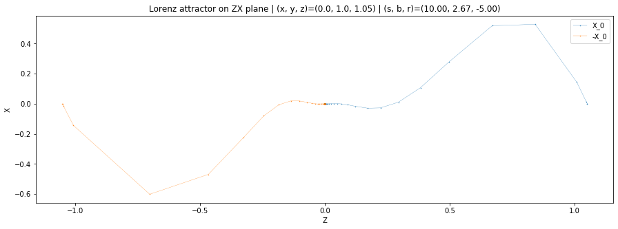
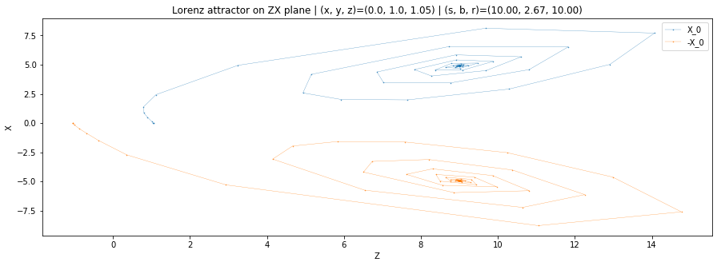
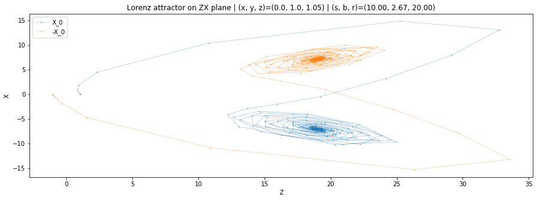
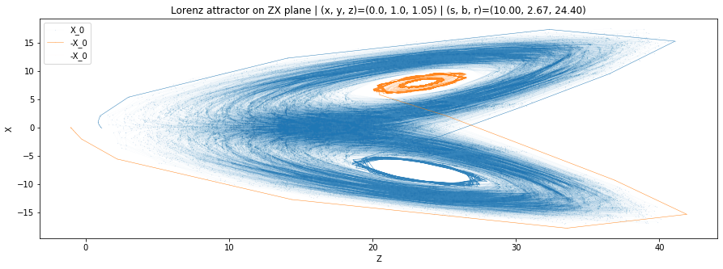
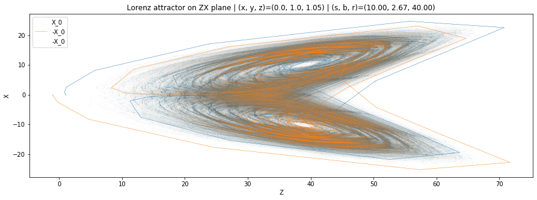
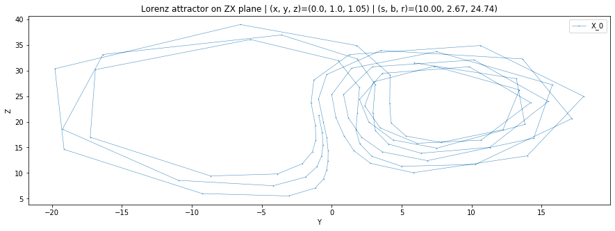
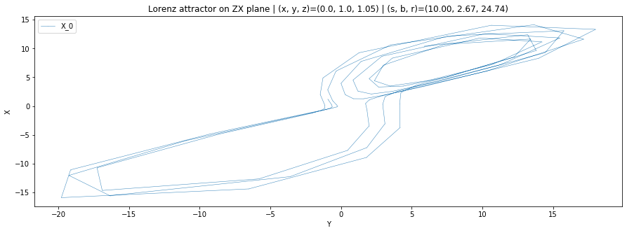
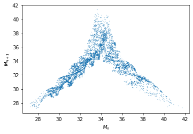
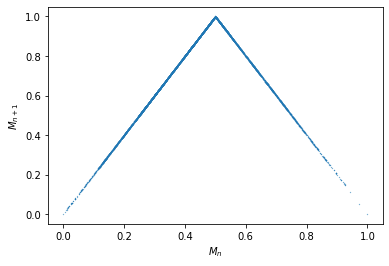

# Atividade 4

*Danilo Lessa Bernardineli (danilo.bernardineli@usp.br)*

### Exercício 1

Neste exercício, obterá-se a solução númerica e visualizações do sistema de Lorenz para diversos parametros visando ilustrar a transicão de um sistema com um único ponto de equilibrio para até um sistema com atratores caóticos e sem ponto de equilibrio.


```python
from scipy.integrate import solve_ivp
import pandas as pd
import seaborn as sns
import matplotlib.pyplot as plt
import numpy as np

def lorenz(t, X, sigma, beta, rho):
    x, y, z = X
    dx = sigma * (y - x)
    dy = rho * x - x * z - y
    dz = x * y - beta * z
    return dx, dy, dz
```


```python
sigma = 10
b = 8 / 3
T = (0, 1000)
```

### Ponto de equilibrio na origem


```python
T = (0, 30)
r = -5
X_0 = (0.0, 1.0, 1.05)

plt.figure(figsize=(15, 5))

f = solve_ivp(lorenz, T, X_0, args=(sigma, b, r), dense_output=True)
(x, y, z) = f.y
t = f.t
plt.title(f"Lorenz attractor on ZX plane"
          f" | (x, y, z)={X_0}"
          f" | (s, b, r)=({sigma:.2f}, {b:.2f}, {r:.2f})")
plt.plot(z, x, '.-', linewidth=0.3, alpha=0.9, markersize=1, label='X_0')

f = solve_ivp(lorenz, T, [-el for el in X_0], args=(sigma, b, r), dense_output=True)
(x, y, z) = f.y
t = f.t
plt.plot(z, x, '.-', linewidth=0.3, alpha=0.9, markersize=1, label='-X_0')

plt.legend()
plt.xlabel("Z")
plt.ylabel("X")
plt.show()
```





### Dois pontos de equilíbrio


```python
X_0 = (0.0, 1.0, 1.05)
T = (0, 50)
r = 10

f = solve_ivp(lorenz, T, X_0, args=(sigma, b, r), dense_output=True)
(x, y, z) = f.y
t = f.t
plt.figure(figsize=(15, 5))
plt.title(f"Lorenz attractor on ZX plane"
          f" | (x, y, z)={X_0}"
          f" | (s, b, r)=({sigma:.2f}, {b:.2f}, {r:.2f})")
plt.plot(z, x, '.-', linewidth=0.3, alpha=0.9, markersize=1, label='X_0')

f = solve_ivp(lorenz, T, [-el for el in X_0], args=(sigma, b, r), dense_output=True)
(x, y, z) = f.y
t = f.t
plt.plot(z, x, '.-', linewidth=0.3, alpha=0.9, markersize=1, label='-X_0')

plt.legend()
plt.xlabel("Z")
plt.ylabel("X")
plt.show()
```





### Órbitas caóticas


```python
X_0 = (0.0, 1.0, 1.05)
T = (0, 50)
r = 20
f = solve_ivp(lorenz, T, X_0, args=(sigma, b, r), dense_output=True)
(x, y, z) = f.y
t = f.t
plt.figure(figsize=(15, 5))
plt.title(f"Lorenz attractor on ZX plane"
          f" | (x, y, z)={X_0}"
          f" | (s, b, r)=({sigma:.2f}, {b:.2f}, {r:.2f})")
plt.plot(z, x, '.-', linewidth=0.3, alpha=0.9, markersize=1.0, label='X_0')

f = solve_ivp(lorenz, T, [-el for el in X_0], args=(sigma, b, r), dense_output=True)
(x, y, z) = f.y
t = f.t
plt.plot(z, x, '.-', linewidth=0.3, alpha=0.9, markersize=1, label='-X_0')

plt.legend()
plt.xlabel("Z")
plt.ylabel("X")
plt.show()
```





### Atratores caóticos


```python
X_0 = (0.0, 1.0, 1.05)
T = (0, 5000)
r = 24.40
f = solve_ivp(lorenz, T, X_0, args=(sigma, b, r), dense_output=True)
(x, y, z) = f.y
t = f.t
plt.figure(figsize=(15, 5))
plt.title(f"Lorenz attractor on ZX plane"
          f" | (x, y, z)={X_0}"
          f" | (s, b, r)=({sigma:.2f}, {b:.2f}, {r:.2f})")
plt.plot(z, x, '.-', linewidth=0.01, alpha=0.9, markersize=0.1, label='X_0')
plt.plot(z[:100], x[:100], '.-', linewidth=0.5, alpha=0.9, markersize=0.1, color='C0')

f = solve_ivp(lorenz, T, [-el for el in X_0], args=(sigma, b, r), dense_output=True)
(x, y, z) = f.y
plt.plot(z[:100], x[:100], '.-', linewidth=0.5, alpha=0.9, markersize=0.1, label='-X_0', color='C1')
plt.plot(z, x, '.-', linewidth=0.005, alpha=0.9, markersize=0.01, label='-X_0', color='C1')

plt.legend()
plt.xlabel("Z")
plt.ylabel("X")
plt.show()
```





### Atratores caóticos sem atratores pontuais


```python
X_0 = (0.0, 1.0, 1.05)
T = (0, 5000)
r = 40
f = solve_ivp(lorenz, T, X_0, args=(sigma, b, r), dense_output=True)
(x, y, z) = f.y
t = f.t
plt.figure(figsize=(15, 5))
plt.title(f"Lorenz attractor on ZX plane"
          f" | (x, y, z)={X_0}"
          f" | (s, b, r)=({sigma:.2f}, {b:.2f}, {r:.2f})")
plt.plot(z, x, '.-', linewidth=0.01, alpha=0.9, markersize=0.1, label='X_0')
plt.plot(z[:100], x[:100], '.-', linewidth=0.5, alpha=0.9, markersize=0.1, color='C0')

f = solve_ivp(lorenz, T, [-el for el in X_0], args=(sigma, b, r), dense_output=True)
(x, y, z) = f.y
plt.plot(z[:100], x[:100], '.-', linewidth=0.5, alpha=0.9, markersize=0.1, label='-X_0', color='C1')
plt.plot(z, x, '.-', linewidth=0.005, alpha=0.9, markersize=0.01, label='-X_0', color='C1')

plt.legend()
plt.xlabel("Z")
plt.ylabel("X")
plt.show()
```





## Exercício 2

### Figure 2


```python
X_0 = (0.0, 1.0, 1.05)
T = (0, 2000)
r = 24.74
f = solve_ivp(lorenz, T, X_0, args=(sigma, b, r), dense_output=True)
(x, y, z) = f.y.T[1400:1500].T

t = f.t

plt.figure(figsize=(15, 5))
plt.title(f"Lorenz attractor on ZX plane"
          f" | (x, y, z)={X_0}"
          f" | (s, b, r)=({sigma:.2f}, {b:.2f}, {r:.2f})")
plt.plot(y, z, '.-', linewidth=0.5, alpha=0.9, markersize=1, label='X_0')
plt.legend()
plt.xlabel("Y")
plt.ylabel("Z")
plt.show()
```





```python
X_0 = (0.0, 1.0, 1.05)
T = (0, 2000)
r = 24.74
f = solve_ivp(lorenz, T, X_0, args=(sigma, b, r), dense_output=True)
(x, y, z) = f.y.T[1400:1500].T

t = f.t

plt.figure(figsize=(15, 5))
plt.title(f"Lorenz attractor on ZX plane"
          f" | (x, y, z)={X_0}"
          f" | (s, b, r)=({sigma:.2f}, {b:.2f}, {r:.2f})")
plt.plot(y, x, '.-', linewidth=0.5, alpha=0.9, markersize=0.1, label='X_0')
plt.legend()
plt.xlabel("Y")
plt.ylabel("X")
plt.show()
```





### Figure 4


```python
X_0 = (0.0, 1.0, 1.05)
T = (0, 5000)
r = 24.74
f = solve_ivp(lorenz, T, X_0, args=(sigma, b, r), dense_output=True)
(x, y, z) = f.y
t = f.t

z = pd.Series(z)
larger_than_next = (z.diff() > 0)
larger_than_previous = (z[::-1].diff() > 0)
relative_max_indices = (larger_than_next & larger_than_previous)
relative_max = z.loc[relative_max_indices]
plt.plot(relative_max[:-1], relative_max[1:], '.', markersize=0.5)

plt.xlabel("$M_n$")
plt.ylabel("$M_{n+1}$")
plt.show()
```





### Figura 5


```python
X_0 = (0.0, 1.0, 1.05)
T = (0, 5000)
r = 24.74
f = solve_ivp(lorenz, T, X_0, args=(sigma, b, r), dense_output=True)
(x, y, z) = f.y
t = f.t

z = pd.Series(z)
larger_than_next = (z.diff() > 0)
larger_than_previous = (z[::-1].diff() > 0)
relative_max_indices = (larger_than_next & larger_than_previous)
relative_max = z.loc[relative_max_indices]
relative_max -= relative_max.min()
relative_max /= relative_max.max()

f = lambda M: 2 * M if M < 0.5 else 2 * (1 - M)

plt.plot(relative_max, relative_max.map(f), '.', markersize=0.5)

plt.xlabel("$M_n$")
plt.ylabel("$M_{n+1}$")
plt.show()
```




